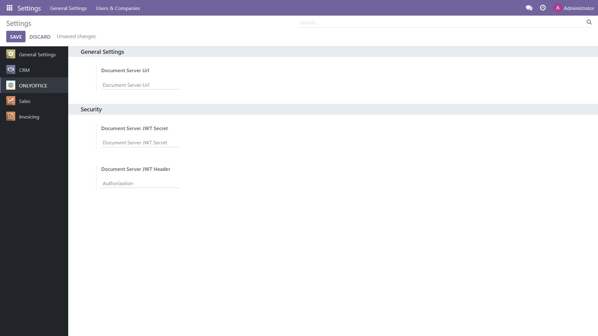

Prerequisites
=============

To be able to work with office files within Odoo, you will need an instance of ONLYOFFICE Docs. You can install the `self-hosted version`_ of the editors (free Community build or scalable Enterprise version), or opt for `ONLYOFFICE Docs`_ Cloud which doesn't require downloading and installation.

ONLYOFFICE app configuration
============================

After the app installation, adjust its settings within your Odoo (*Home menu -> Settings -> ONLYOFFICE*).
In the **Document Server Url**, specify the URL of the installed ONLYOFFICE Docs or the address of ONLYOFFICE Docs Cloud.

**Document Server JWT Secret**: JWT is enabled by default and the secret key is generated automatically to restrict the access to ONLYOFFICE Docs. if you want to specify your own secret key in this field, also specify the same secret key in the ONLYOFFICE Docs `config file`_ to enable the validation.

**Document Server JWT Header**: Standard JWT header used in ONLYOFFICE is Authorization. In case this header is in conflict with your setup, you can change the header to the custom one.

In case your network configuration doesn't allow requests between the servers via public addresses, specify the ONLYOFFICE Docs address for internal requests from the Odoo server and vice versa.

If you would like the editors to open in the same tab instead of a new one, check the corresponding setting "Open file in the same tab".

Contact us
==========

If you have any questions or suggestions regarding the ONLYOFFICE app for Odoo, please let us know at https://forum.onlyoffice.com

.. _self-hosted version: https://www.onlyoffice.com/download-docs.aspx
.. _ONLYOFFICE Docs: https://www.onlyoffice.com/docs-registration.aspx
.. _config file: https://api.onlyoffice.com/docs/docs-api/additional-api/signature/

1. 核心地址参数（最关键）

ONLYOFFICE Docs address (外部地址)

作用：这是给浏览器看的。当用户点击编辑文档时，浏览器需要通过这个地址去加载 OnlyOffice 编辑器界面。

填法：填你的云端或 Ngrok 公网地址（如 https://office.beesmartsys.eu或你的 Ngrok 域名）。

Server address for internal requests from ONLYOFFICE Docs (回调地址)

作用：这是给云端 OnlyOffice 服务器看的。文档编辑完后，OnlyOffice 需要把修改后的文件数据“回传”给 Odoo，它就通过这个地址找你。

填法：必须填 Odoo 的真实可访问地址。如果填 127.0.0.1或 localhost，云服务器是找不到你本机的。在开发环境中，这里必须填你的 Ngrok 公网域名（不带端口），因为它是唯一能让外网访问到你本地 8089 端口的通道。

2. 安全认证参数 (JWT)

ONLYOFFICE Docs secret key / JWT Header

作用：为了防止数据被篡改，云端 OnlyOffice 在回调 Odoo 时会带一个签名（Token）。Odoo 需要用这个 Secret key来验证签名是否合法。如果不一致，Odoo 会拒绝接收文件。

填法：两端（Odoo 设置和 OnlyOffice 配置文件 local.json）必须完全一致。

3. 辅助参数

Disable certificate verification

作用：自签名证书或某些内网环境的 HTTPS 证书可能不被信任。勾选此项可以跳过 SSL 证书校验，避免因证书报错导致连接中断。

Connect to demo ONLYOFFICE Docs server

作用：提供一个公共测试服务器。勾选后，上面的地址配置会暂时失效，直接连官方Demo。主要用于无服务器的快速测试，生产环境绝对不能用。